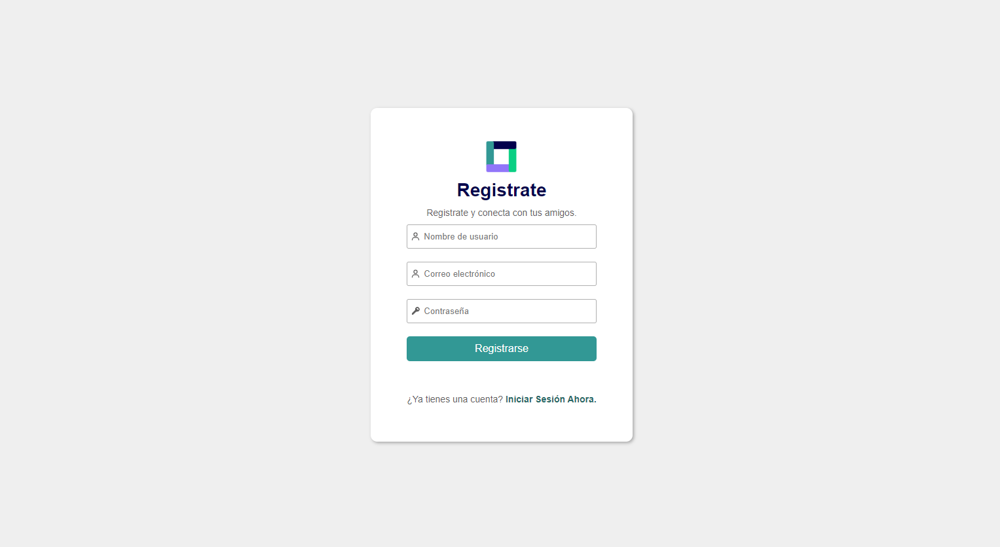
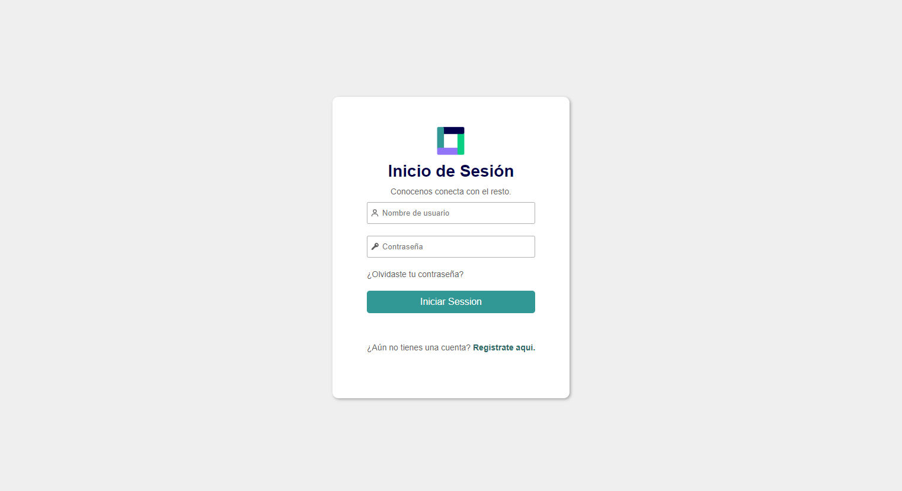
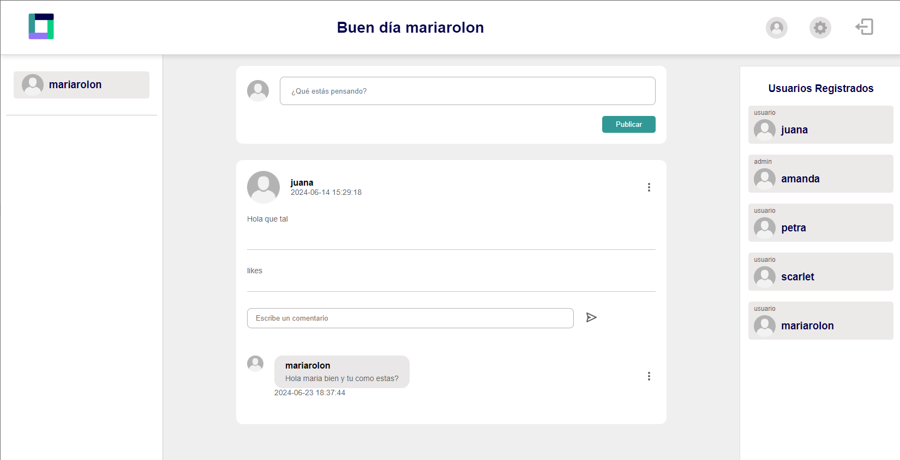
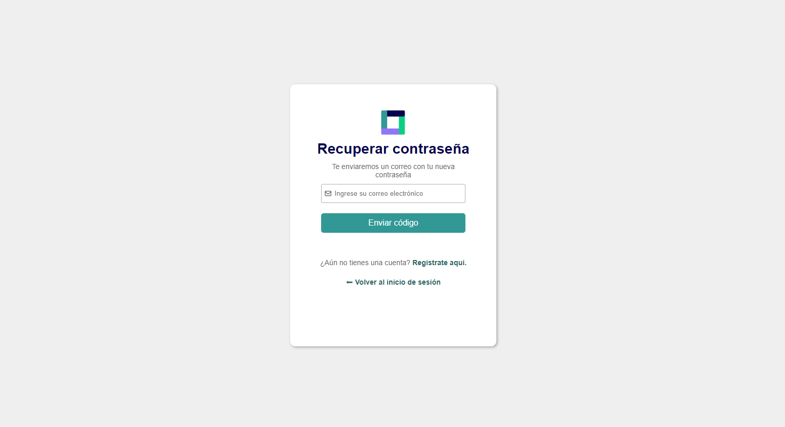

# 💫Red Social Interactiva con PHP (Stack LAMP)💫
Esta aplicación fue desarrollada con el objetivo de poner en práctica mis habilidades en el desarrollo web utilizando el lenguaje de programación PHP. Está diseñada para gestionar usuarios mediante una base de datos relacional, donde se almacena la información de los usuarios registrados. Además del registro, se implementa un sistema de login que genera y almacena tokens para la autenticación de sesiones.
La aplicación permite gestionar diversas funcionalidades, incluyendo publicaciones y comentarios, todos almacenados y gestionados de manera eficiente en la base de datos. Aunque está optimizada para pantallas de escritorio de diferentes tamaños, actualmente no cuenta con soporte para dispositivos móviles.
La interfaz de usuario se caracteriza por su simplicidad, diseñada para destacar las funcionalidades implementadas y asegurar un uso fluido y efectivo de la aplicación. El proyecto tiene como objetivo principal demostrar el funcionamiento adecuado de las funcionalidades implementadas.

## 💻 Tecnologias Stack LAMP:
- PHP (Como Lenguaje).
- Mysql.

## ⚙ Funcionalidades:
- **Registro:** El usuario se puede registrar y sus datos serán almacenados en la base de datos.
- **Login:** El usuario podrá iniciar sesión y al mismo tiempo se almacenará un token que permitirá mantener la sesión activa por un tiempo determinado.
- **Validaciones:** La aplicación informa al momento de registrarse y de iniciar sesión si se está ingresando un dato inválido.
- **Correo de bienvenida:** Al registrarte en la aplicación se enviará un correo electrónico de bienvenida al correo registrado.
- **Recuperación de contraseña:** La aplicación tiene la opción de recuperar contraseña y se enviará un correo al correo registrado del usuario el cual obtendrá una nueva contraseña temporal.
- **Contraseña encriptada:** La contraseña sera encriptada dentro de nuestra base de datos.
- **Rutas privadas y publicas:** No se puede acceder a ciertas rutas si no eres administrador o si no tienes una sesion iniciada.
- **Roles de usuario:** Dentro de la aplicación existen dos tipos de usuarios, el usuario común y el usuario administrador.
- **Administración:** El administrador puede ver a todos los usuarios, editar su información y eliminarlos si así lo requiere tambien puede hacer esto con las publicaciones y comentarios.
- **Información de otros usuarios y propia del usuario:** La aplicación tiene una sección que permite ver al usuario los otros usuarios registrados y puede ver por una ventana emergente su información pública como también puede ver su propia información.
- **Editar informacion personal:** El usuario podra editar su informacion personal si asi lo requiere.
- **Cerrar sesión:** Se elimina el token del usuario que estaba previamente logueado.
- **Publicaciones:** El usuario podrá hacer publicaciones y otros usuarios podran interactuar.
- **Comentarios:** El usuario podra hacer comentarios dentro de las publicaciones que desee.
  
## ⚙ Inicialización:
Para iniciar la aplicación PHP, es esencial tener XAMPP instalado en tu sistema. Debes asegurarte de que Apache y MySQL estén activos desde el panel de control de XAMPP. El proyecto debe ubicarse dentro del directorio htdocs, que es el directorio de trabajo predeterminado de XAMPP. Una vez configurado, accede al panel de administración de Apache ingresando http://localhost en tu navegador. Sustituye "Dashboard" por el nombre de la carpeta donde se encuentra tu proyecto para acceder y visualizar tu aplicación en el navegador local.

## 🖼 interfaz y experiencia de usuario:
- **Registro:**

- **Login:**

- **Feed del Usuario:**

- **Feed del Usuario:**

